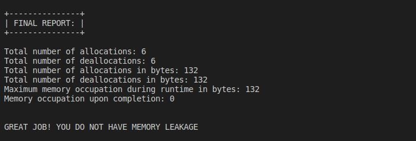

# CppND-Garbage-Collector
The final project for this Memory Management course is to implement your own
version of a smart pointer. You can think of this as implementing your own
garbage collector, to use a concept from other programming languages. Building
this project will help you understand both how to work with pointers and
references, and also why smart pointers are so important to modern C++
programming. Complete the implementations and verify that your implementation
does not have any memory leaks!

# Building
To build this project, you will need a C++ compiler. The `make` script provided
assumes the GCC compiler, however you may substitute an equivalent C++ compiler
by adjusting the `make` script as needed. Execute the make script, then run the
compiled executable.

If the code fails to compile, the execute won't be created or will remain the
last-compiled version. Adjust your code to resolve compiler errors and try again.

``` shell
$ ./make
$ ./compiled
```

## Project TODO List:
- Complete `Pointer` constructor
- Complete `Pointer` `operator==`
- Complete `Pointer` destructor
- Complete `PtrDetails` class

## Results:

